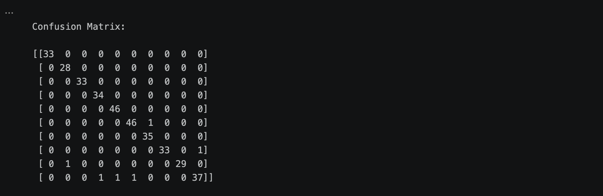
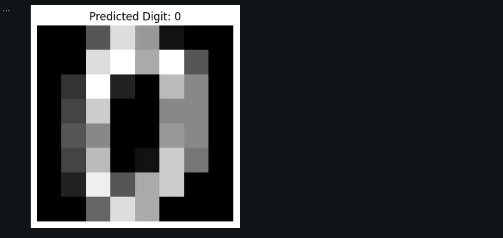

# Handwritten Digit Recognition using Machine Learning
This project uses machine learning to classify handwritten digits (0–9) using image data. The model is trained using the K-Nearest Neighbors (KNN) algorithm and evaluated using accuracy and confusion matrix.

## Tech Stack
* Python
* Scikit-learn
* NumPy
* Matplotlib

## Results
* Accuracy: 98.33%
* High classification performance with minimal errors

## Output
### Accuracy

### Confusion Matrix

### Prediction

## Features
* Digit image classification
* Model training using KNN
* Accuracy evaluation
* Confusion matrix analysis
* Visualization of predicted digits

## Future Scope
* Implement CNN for better performance
* Build a web interface using Streamlit
